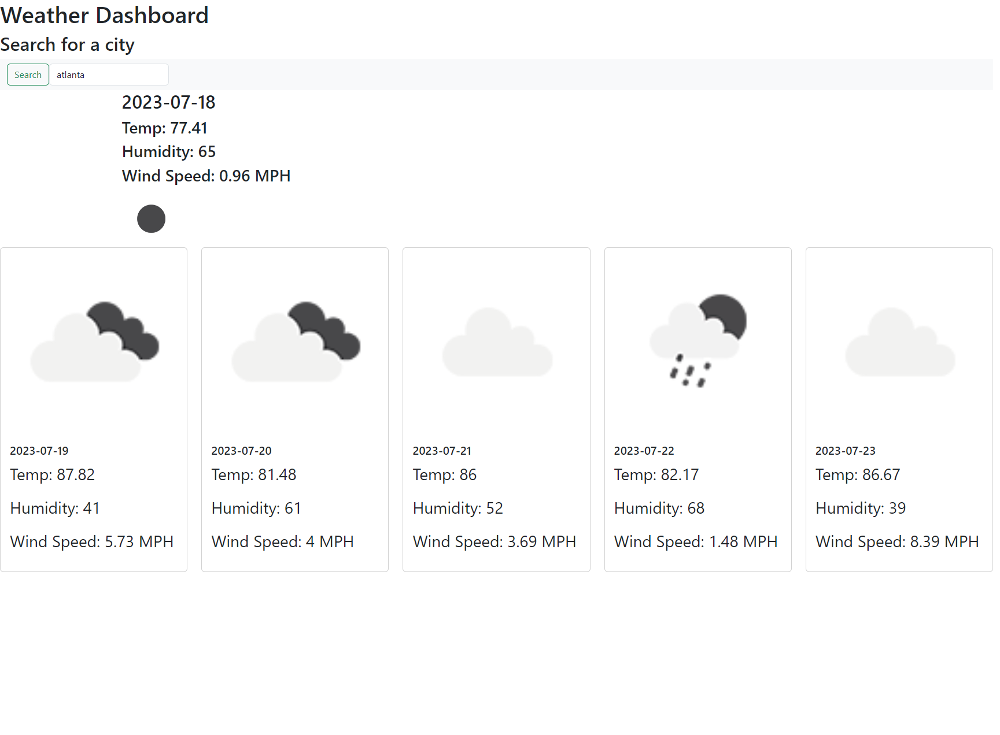

# 06 Server-Side APIs: Weather Dashboard

## User Story

```
AS A traveler
I WANT to see the weather outlook for multiple cities
SO THAT I can plan a trip accordingly
```
## Deployment

<a href ="https://pkykev.github.io/weatherapp/">WeatherApp</a>

## Screenshot

